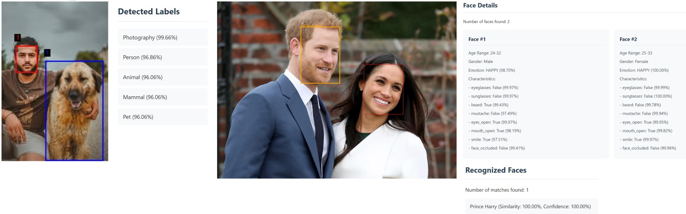
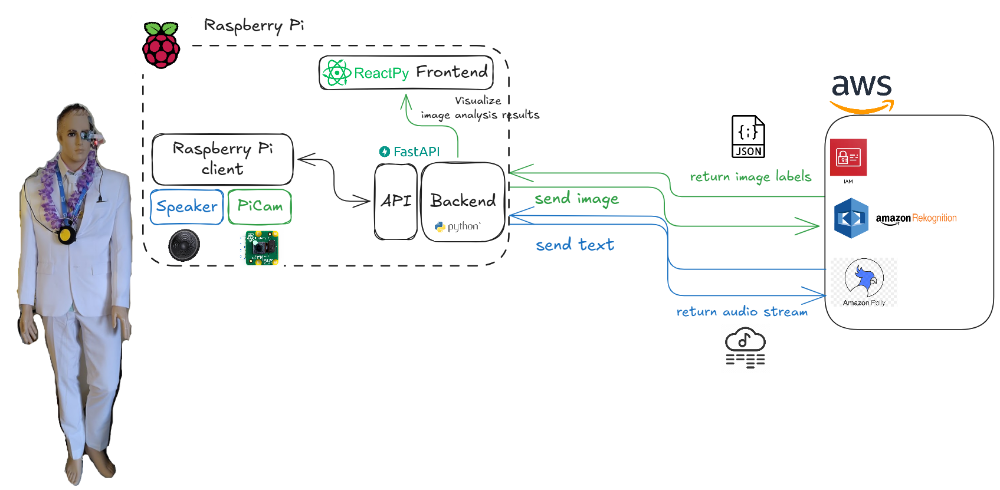
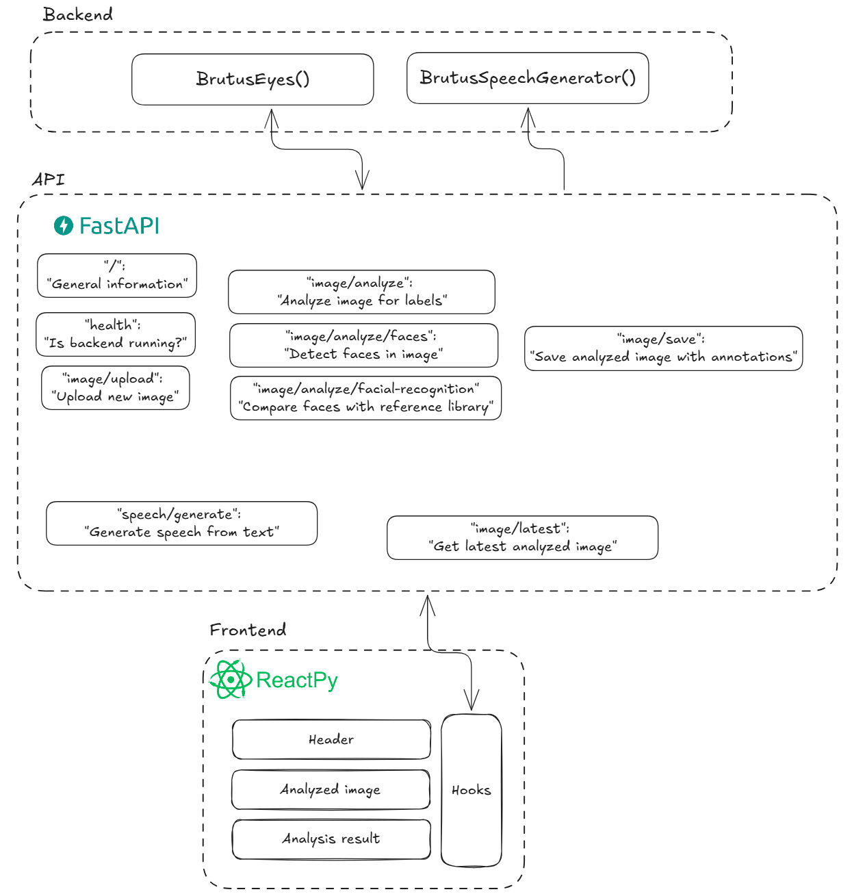
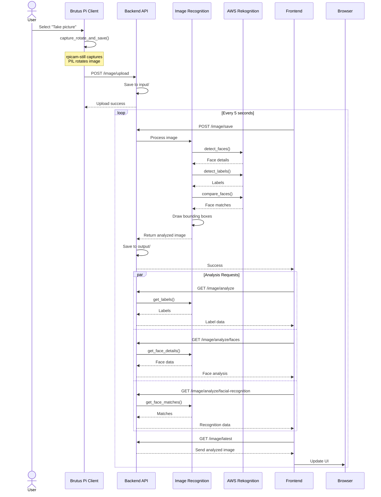

# B.R.U.T.U.S.

## Introduction
Brutus is an artificial intelligence robot built on top of AWS machine learning services, Raspberry PI and related machinery. The project is coded in Python.

[](https://www.youtube.com/watch?v=4MI_6AYFU6Y)

This project includes a Raspberry Pi client, API backend interface created with [FastAPI](https://fastapi.tiangolo.com), and frontend built with [ReactPy](https://reactpy.dev/docs/index.html).  Backend and frontend are served via [uvicorn](https://www.uvicorn.org) web servers, which you can access via browser on your local network.

[Poetry](https://python-poetry.org) is used for dependency management and packaging. [Precommit framework](https://pre-commit.com) is used to check code formatting, linting etc. prior to committing changes to repository.


## Features
### Now
- **Image recognition:** [Recognise objects](https://docs.aws.amazon.com/rekognition/latest/dg/labels-detect-labels-image.html) in an image, [analyze people and faces](https://docs.aws.amazon.com/rekognition/latest/dg/faces.html), and do [facial recognition](https://docs.aws.amazon.com/rekognition/latest/dg/collections.html) given that reference face image is available.


- **Speech generation:** [Brutus can speak](https://docs.aws.amazon.com/polly/latest/dg/synthesize-example.html) whetever (English) text is given to it.

### Upcoming
- **Weather detection:** Get data from [RuuviTag](https://github.com/ttu/ruuvitag-sensor) to see room temperature, humidity and air pressure.
- **Servo motors:** Utilize servo motors via Arduino integration, giving Brutus arm movement.
- **Voice commands:** Call Brutus' features via Amazon Alexa.
- **Discussion mode:** Utilize Amazon Lex and AWS Bedrock to return poems or summaries of image analysis results, or discuss philosophy with Brutus.


## Architecture
### High-level architecture
#### Vision
*Have a robot that can take pictures, analyze them and present results to the audience. The robot should be able to speak and listen to commands. Software should be modular and easy to extend with new features.*


#### Implementation
Backend is built with FastAPI and it uses Python classes to call AWS services. Frontend is built with ReactPY and it uses hooks to call backend.  Raspberry Pi client is a terminal interface for commanding backend.

This separation allows for adding new features to backend or adding new frontend components more flexibly. For example, if we wanted to add a new feature to Brutus, we could add a new Python class to backend, add a new API endpoint to FastAPI, and add a new React component to frontend. This way, we can keep the existing features intact and only add new features.

Also if we wanted to host Brutus in the cloud, we could move backend and frontend to a cloud server and keep Raspberry Pi client running on a local computer. This way, we could access "Brutus' brain" from anywhere in the world.

- **Raspberry Pi Client**: Terminal interface for commanding backend, e.g. take pictures or produce audio.
- **API**: Wrapper for backend functionalities that allows for adding new functionalities or changing backend provider more flexibly. FastAPI implementation using OpenAPI docs and attempts to follow API design best practices with endpoint naming at least.
- **Backend**: Image recognition, speech generation, ... that are exposed to frontend and client via API. Implemented by Python classes using botocore to communicate with AWS services.
- **Frontend**: Presentation layer for audience to see image analysis details. A ReactPY frontend using hooks to call FastAPI backend.

### Software components



### API event flow
Sequence diagram illustrating the flow of what happens when Brutus is commanded to take a picture, analyze it and present results in UI. Similar but more simplistic flow occurs when Brutus is told to speak up (Raspberry Pi client sends text to /speech API endpoint, which forwards it to AWS Polly API, which returns an audio stream that is played back via speaker).



## Project Structure
```
brutus/
├── backend/
│   ├── api.py              # Main FastAPI application
│   ├── image_recognition.py # AWS Rekognition wrapper
│   └── speech_generator.py  # AWS Polly wrapper
├── frontend/
│   ├── main.py            # Main frontend application
│   └── static/
├── raspberrypi_client/    # Raspberry Pi terminal client
│   └── brutus_pi.py
└── scripts/               # Helper scripts
    ├── start_fe_be.sh     # Start frontend and backend
    └── start_client.sh    # Start Raspberry Pi client
```
Each component is defined with Poetry project template. See installation prerequisites - after they are met, each component can be set up with Poetry commands. Each component has its own .env file for environment variables.

### Opinions on some choices
#### Backend folder structure
Backend is for now a mix of Python files - FastAPI main app named api.py, and backend modules made of Python classes and methods, which FastAPI endpoints call.

There are [at least two common project templates for FastAPI projects](https://medium.com/@amirm.lavasani/how-to-structure-your-fastapi-projects-0219a6600a8f), neither of which this solution uses.

Maybe if I separated backend modules into models, routes, services etc. in theory the FastAPI app itself could be fully agnostic of backend service. Maybe I could mock and test interfaces in more puristic manner - but I feel that in reality, if I were to change backend from e.g. Rekognition to some Google image recognition api or esp32cam image detection, I'd anyhow need to write the interfaces anew. Also this isn't a wrapper for database using SQLAlchemy.

Thus I argue that for now, this file structure abides by KISS principle and is the most maintainable in its current form.

#### Logging module is duplicated code
logging_utils.py is copy-pasted into each folder. It could be a shared component. For now I wanted to avoid shared components, which caused the need to duplicate code.
Justification for this is that I'm still pondering should frontend and backend be moved out of Raspberry Pi so they'd run either on another local computer, or maybe run them in the cloud.
Until I decide on the final architectural solution, I see little harm in duplicating this one module.

#### Frontend is a single file
Frontend is a single file, main.py. This is because I wanted to keep the frontend as simple as possible. I could have split it into components, but I wanted to avoid overengineering.

## Installation

### Hardware prerequisites
- Raspberry Pi (confirmed working on model 3B)
- Raspberry Pi Camera (at least v2)
- Speaker
- Mannequin (mandatory, code won't work without this.)

### Software prerequisites
* Python 3.10 or higher
* AWS CLI configured with AWS SSO
* IAM role with proper RBAC ([see example IAM role definition](./brutus-iam-role.yaml))
* [Poetry](https://python-poetry.org/docs/#installation) for dependency management

```bash
sudo apt-get install awscli rpicam-still
```
- Optional: precommit framework.

### Setup
1. Clone the repository:
```bash
git clone https://github.com/yourusername/brutus.git
```

2. Set up environment variables:
```bash
aws sso configure
```

**Backend (.env)**
```ini
AWS_PROFILE=your-profile
AWS_REGION=eu-central-1
```

**Frontend (.env)**
```ini
BACKEND_URL=http://192.168.999:8000
```

**Raspberry Pi Client (.env)**
```ini
BACKEND_URL=http://192.168.999:8000
```

- Put your Raspberry PI IP address in frontend and raspberrypi_client .env files in backend url record.

3. Run these in backend, frontend and raspberrypi_client folders, respectively:
```bash
poetry lock
poetry install
```
### Local Development
You can run each service individually, or all at once using helper scripts. Start each service in its own terminal with the following commands:
1. Start backend for development (requires AWS access):
```bash
cd backend
poetry run task dev
```

2. Start frontend for development (depends on backend running):
```bash
cd frontend
poetry run task dev
```

3. Start Raspberry Pi client (depends on backend running):
```bash
cd raspberrypi_client
poetry run task dev
```
Note: Raspberry Pi client depends on Raspberry Pi camera and speaker being connected to the Raspberry Pi, so you may not be able to run it successfully on your local machine.

## Usage
TB: Screenshots of terminal and frontend.

## Troubleshooting
Common issues and their solutions:

1. **Camera not working**
   - Check camera is enabled: `sudo raspi-config`
   - Verify permissions: `ls -l /dev/video0`

2. **AWS Authentication**
   - Verify AWS SSO login: `aws sso login`
   - Check role permissions

3. **Audio Issues**
   - Test audio: `speaker-test -t wav`
   - Check volume: `alsamixer`

## Monitoring
Logs are formed in JSON format to logs folder in each component. Log file is generated daily and record contains details of datetimestamp, log level, origin event filename, class, method and row number that produced the log event.

## Tests
Each service contains at least some unit tests. You can run them with Poetry:
```bash
poetry run task test
```
Note that most depend on AWS access working.

Code formatting, linting, other standard checks can be performed with precommit:
```bash
pre-commit run --all-files
```
