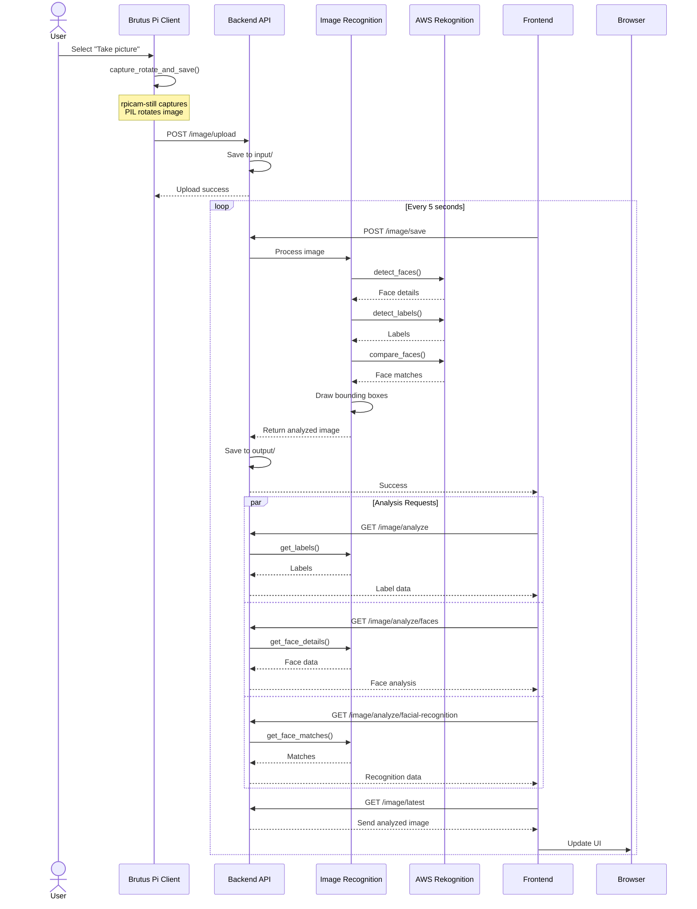
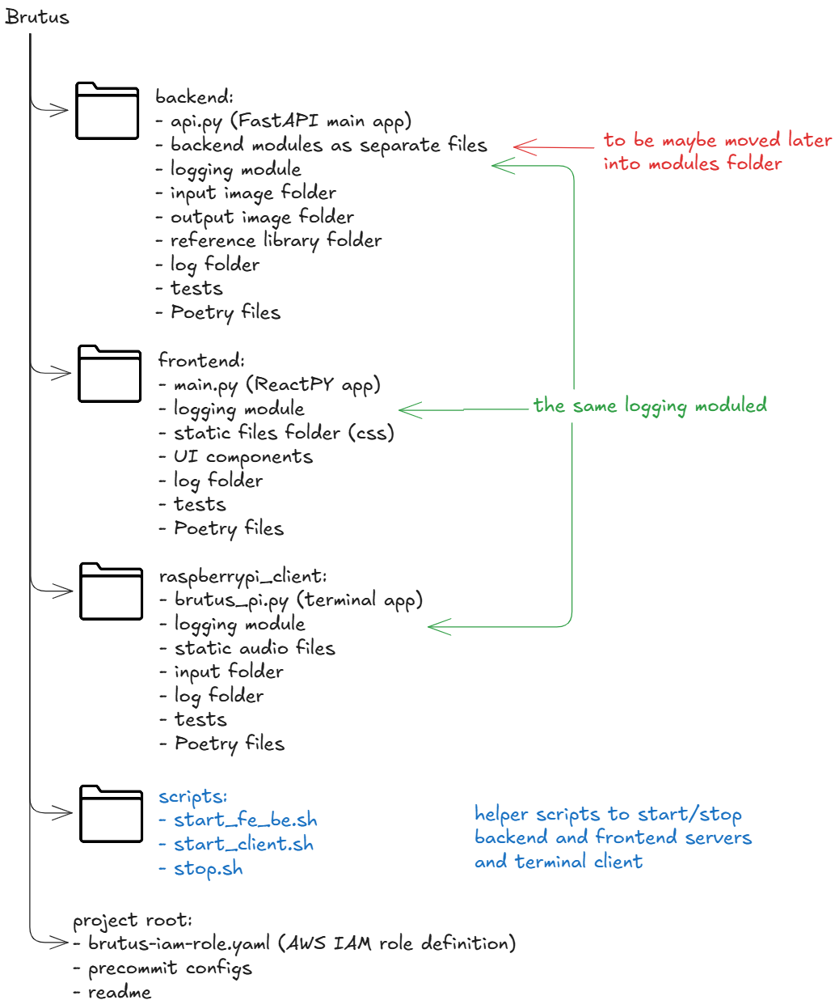

# B.R.U.T.U.S.

## Introduction
Brutus is an artificial intelligence robot built on top of AWS machine learning services, Raspberry PI and related machinery. The project is coded in Python.

This project includes a Raspberry Pi client, API backend interface created with [FastAPI](https://fastapi.tiangolo.com), and frontend built with [ReactPy](https://reactpy.dev/docs/index.html).  Backend and frontend are served via [uvicorn](https://www.uvicorn.org) web servers, which you can access via browser on your local network.

[Poetry](https://python-poetry.org) is used for dependency management and packaging. [Precommit framework](https://pre-commit.com) is used to check code formatting, linting etc. prior to committing changes to repository.


## Features
### Now
- **Image recognition:** Recognise objects in an image, analyze people and faces, and do facial recognition given that reference face image is available.


- **Speech generation:** Brutus can speak whetever (English) text is given to it.

### Upcoming
- **Weather detection:** Get data from RuuviTag to see room temperature, humidity and air pressure.
- **Servo motors:** Utilize servo motors via Arduino integration, giving Brutus arm movement.
- **Voice commands:** Call Brutus' features via Amazon Alexa.
- **Discussion mode:** Utilize Amazon Lex and AWS Bedrock to return poems or summaries of image analysis results, or discuss philosophy with Brutus.


## Architecture
### High-level architecture

- **Raspberry Pi Client**: Terminal interface for commanding backend, e.g. take pictures or produce audio.
- **API**: Wrapper for backend functionalities that allows for adding new functionalities or changing backend provider more flexibly. FastAPI implementation using OpenAPI docs.
- **Backend**: Image recognition (BrutusEyes), speech generation (BrutusSpeechGenerator), ... that are exposed to frontend and client via API. Python classes using botocore to communicate with AWS services.
- **Frontend**: Presentation layer for audience to see image analysis details. A ReactPY frontend using hooks to call FastAPI backend.

### Software components

Basic idea is to have separated backend and frontend with a client calling backend via API endpoints. This should allow for adding new features later without having to refactor the entire implementation, and switching from current terminal client to for example voice commands. Frontend is built with ReactPY and it uses hooks to call backend. This makes frontend development clean and keeps it as a presentation layer only.

### API flow
Sequence diagram illustrating the flow of what happens when Brutus is commanded to take a picture, analyze it and present results in UI. Similar but more simplistic flow occurs when Brutus is told to speak up (Raspberry Pi client sends text to /speech API endpoint, which forwards it to AWS Polly API, which returns an audio stream that is played back via speaker).



## Project Structure
Each component is defined with Poetry project template. See installation prerequisites - after they are met,
each component can be set up with Poetry commands.

### Opinions on some choices
#### Backend folder structure
Backend is for now a mix of Python files - FastAPI main app named api.py, and backend modules made of Python classes and methods, which FastAPI endpoints call.

There are [at least two common project templates for FastAPI projects](https://medium.com/@amirm.lavasani/how-to-structure-your-fastapi-projects-0219a6600a8f), neither of which this solution uses.

Maybe if I separated backend modules into models, routes, services etc. in theory the FastAPI app itself could be fully agnostic of backend service. Maybe I could mock and test interfaces in more puristic manner - but I feel that in reality, if I were to change backend from e.g. Rekognition to some Google image recognition api or esp32cam image detection, I'd anyhow need to write the interfaces anew. Also this isn't a wrapper for database using SQLAlchemy.

Thus I argue that for now, this file structure abides by KISS principle and is the most maintainable in its current form.

#### Logging module is duplicated code
logging_utils.py is copy-pasted into each folder. It could be a shared component. For now I wanted to avoid shared components, which caused the need to duplicate code.
Justification for this is that I'm still pondering should frontend and backend be moved out of Raspberry Pi so they'd run either on another local computer, or maybe run them in the cloud.
Until I decide on the final architectural solution, I see little harm in duplicating this one module.




## Installation

### Hardware
- Raspberry Pi (this one is working on model 3B)
- Raspberry Pi Camera (at least v2)
- Speaker
- Mannequin (mandatory, code won't work without this.)

### Software prerequisites
* Python 3.10 or higher
* AWS CLI configured with AWS SSO
* IAM role with proper RBAC ([see example IAM role definition](./brutus-iam-role.yaml))
* [Poetry](https://python-poetry.org/docs/#installation) for dependency management
* ```bash
sudo apt-get install awscli rpicam-still
```
Optional: precommit framework.

### Setup
1. Clone the repository:
```bash
git clone https://github.com/yourusername/brutus.git
```

2. Set up environment variables:
```bash
aws sso configure
```

- Add AWS IAM user role and region to .env file in backend folder.
- Put your Raspberry PI IP address in frontend and raspberrypi_client .env files in backend url record.

3. Run these in backend, frontend and raspberrypi_client folders, respectively:
```bash
poetry lock
poetry install
```
4. Now you can use helper scripts to start services:
- start_fe_be.sh: start backend and frontend servers.
- start_client.sh: start terminal client.

## Usage
TB: Screenshots of terminal and frontend.


## Monitoring
Logs are formed in JSON format to logs folder in each component. Log file is generated daily and record contains details of datetimestamp, log level, origin event filename, class, method and row number that produced the log event.

## Tests
Each service contains at least some unit tests. You can run them with Poetry:
```bash
poetry run task test
```
Note that most depend on AWS access working.
